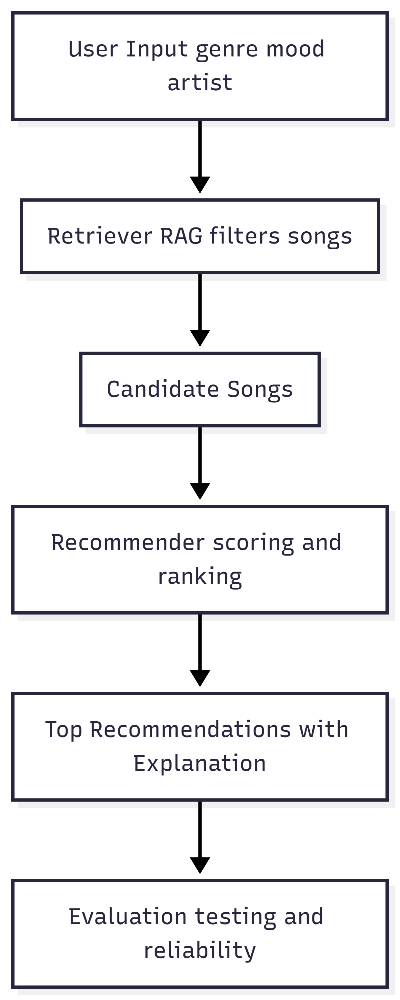

# 🎵 AI Music Recommender System (RAG-Based)

## 📌 Project Summary

This project extends my original **Music Recommender Simulation** into a complete applied AI system.

The original system used a content-based approach to recommend songs based on attributes like genre, mood, and energy. It scored songs against a user's preferences and returned ranked recommendations with explanations.

In this final version, I enhanced the system by adding a **Retrieval-Augmented Generation (RAG)** pipeline, modular design, and testing features to make it more realistic, reliable, and aligned with real-world AI systems.

---

## 🤖 What This System Does

* Takes user input (genre, mood, or artist)
* Retrieves relevant songs from the dataset (**RAG step**)
* Scores and ranks songs using a recommendation algorithm
* Generates explanations for each recommendation
* Includes testing to evaluate system reliability

---

## 🧠 How The System Works

Real-world platforms like Spotify combine collaborative filtering and content-based filtering. This system focuses on **content-based filtering**, but now includes a retrieval step to improve efficiency and relevance.

### 🔹 AI Pipeline (Updated)

```
User Input
    ↓
Retriever (filters relevant songs)
    ↓
Candidate Songs
    ↓
Recommender (scoring + ranking)
    ↓
Top Results + Explanation
    ↓
Evaluation (testing system behavior)
```

---

## ⚙️ Algorithm Recipe

Each song is scored using weighted rules:

| Rule                                | Points    |
| ----------------------------------- | --------- |
| Genre matches user preference       | +2.0      |
| Mood matches user preference        | +1.0      |
| Energy closeness (1.0 minus gap)    | 0.0 – 1.0 |
| High valence bonus (happy songs)    | +0.5      |
| Acoustic preference bonus           | +0.5      |
| Popularity / era bonuses (optional) | +0.5      |

Songs are sorted by score and the top K results are returned.

---

## 📊 Features Used

**Song attributes:**
`genre`, `mood`, `energy`, `valence`, `acousticness`, `tempo_bpm`, `danceability`, `popularity`, `era_tag`

**User preferences:**
`genre`, `mood`, `energy`, `likes_acoustic`

---

## 📂 Project Structure

```
music-recommender-ai/
│
├── src/
│   ├── main.py
│   ├── recommender.py
│   ├── retriever.py
│   ├── evaluator.py
│
├── data/
│   └── songs.csv
│
├── tests/
│   └── test_recommender.py
│
├── assets/
│   └── diagram.png
│
├── README.md
├── model_card.md
├── requirements.txt
```

---

## ▶️ How to Run

### 1. Install dependencies

```
pip install -r requirements.txt
```

### 2. Run the system

```
python src/main.py
```

### 3. Run tests

```
pytest
```

---

## 💻 Example Interaction

```
Input: pop

Output:
1. Good Vibes Only by Indigo Parade
Score: 4.50
Why: genre match (+2.0), mood match (+1.0), energy similarity (+0.85)

2. Sunrise City by Neon Echo
Score: 4.47
Why: genre match (+2.0), energy similarity (+0.82)
```

---

## 🧪 Testing & Evaluation

The system was tested using multiple queries:

* pop
* happy
* rock

### Results:

* All test queries returned valid recommendations
* The system performs well when input matches dataset
* It struggles when context is missing or unclear

The test file ensures:

* Recommendations are correctly sorted
* Explanations are generated

---

## ⚠️ Potential Biases

* Genre has high weight, which can dominate results
* Dataset contains more pop and lofi songs than other genres
* No long-term personalization (no learning over time)

---

## ⚖️ Limitations

* Keyword-based retrieval (not semantic understanding)
* Small dataset limits diversity
* Cannot handle complex or mixed preferences

---

## 🔐 Ethical Considerations

* May reinforce popularity bias
* Could over-recommend dominant genres
* Needs more balanced data for fairness

---

## 🧠 Reflection

This project helped me understand how a basic recommendation system can be extended into a full AI system.

Adding the retrieval step (RAG) showed how real systems narrow down data before making decisions. I also learned that testing and handling edge cases is very important for making AI systems reliable.

---

## 🎥 Demo Video


---

## 📁 Portfolio Value

This project demonstrates:

* Building an end-to-end AI system
* Using Retrieval-Augmented Generation (RAG)
* Designing modular and testable code
* Evaluating system reliability and bias

---
## 📊 System Architecture

